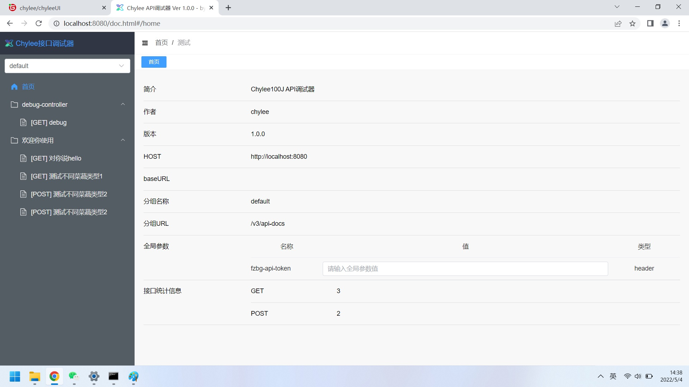
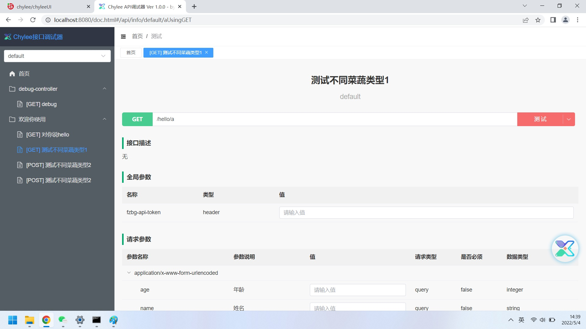
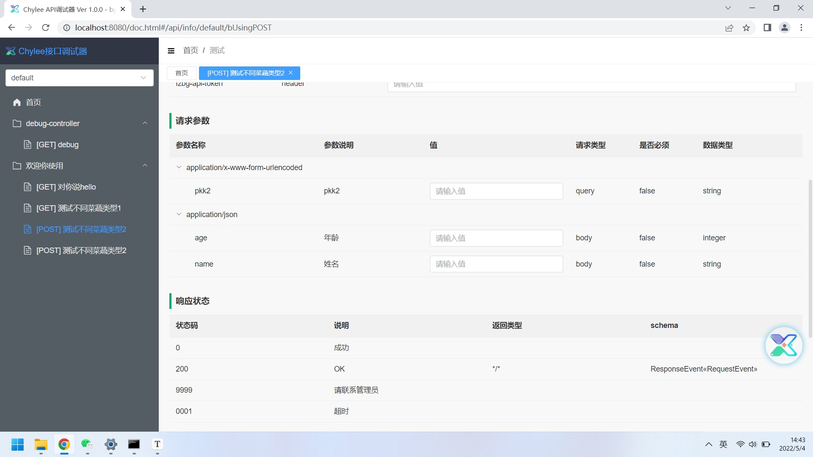
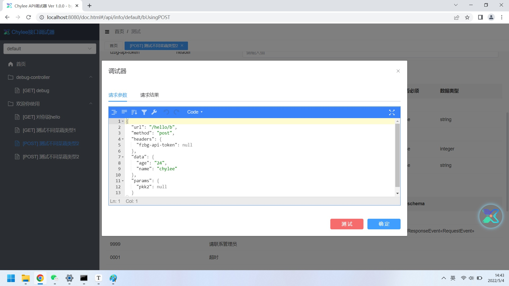

#### 安装使用

1. 打包module-chyee-ui模块

2. 在你的项目中添加上一步生成的jar包

   ```xml
   <dependency>
      <groupId>com.chylee</groupId>
      <artifactId>swagger-ui</artifactId>
      <version>1.0.0</version>
   </dependency>
   ```

3. 参照swagger3.0配置

4. 启动项目，浏览器打开地址：

   ```url
   http://localhost:8080/doc.html
   ```

#### 界面预览








